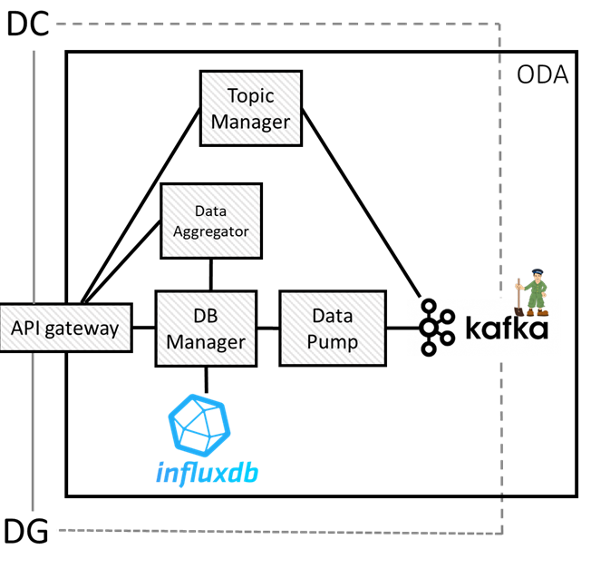

# ODA - Observable Data Access

Observable Data Access service developed within NEST Project, Task 8.6.2.

## Overview



The Observable Data Access (ODA) service is a microservice-based architecture that allows Data Generators to send data to the service and Data Consumers to query the data stored in the service. The service is composed of the following microservices:

1. API Gateway: the entry point of the service. It provides the Kafka endpoint to Data Generators and Data Consumers and manages the registration of the topics. It also provides the query endpoint to Data Consumers.
2. Database Manager: the microservice that manages the InfluxDB database. It stores the data sent by the Data Generators and provides the data to the Data Consumers.
3. InfluxDB: the time-series database that stores the data sent by the Data Generators.
4. Kafka: the message broker - managed by Zookeeper - that allows Data Generators to stream data through ODA and Data Consumers to receive streamed data through ODA.
5. Data Pump: the microservice that subscribes to the Kafka topics and sends the data to be stored to the Database Manager.
6. Topic Manager: the microservice that manages the Kafka topics registered in ODA.

The [detailed overview](/docs/ODA.pdf) is available in the `docs` folder.

## Prerequisites

* ODA is versioned using [Git](https://git-scm.com/). To clone the repository, you need to have Git installed on the target machine.
* ODA is shipped using [Docker](https://www.docker.com/) and deployed using [Docker Compose](https://docs.docker.com/compose/). To run the service, you need Docker and Docker Compose installed and running on the target machine.

## Quick start

To run the ODA service with default configuration, follow these steps:

1. Clone the repository:

```git clone https://github.com/di-unipi-socc/ODA.git```

2. Navigate to the repository:

```cd ODA```

3. Build and Run ODA:

```./start.sh```

To stop ODA execute:

```./stop.sh```

To remove ODA execute:

```./clean.sh```    to remove the Docker images and the Docker network.
```./clean.sh -v``` to remove the Docker images, the Docker network and the db volumes (deleting all db data).

## API

Data Generators and Data Consumers can obtain the Kafka endpoint from the API Gateway.
The API of the API Gateway is documented using [Swagger](https://petstore.swagger.io/?url=https://raw.githubusercontent.com/alebocci/ODA/main/docs/ODAopenapi.yaml?token=GHSAT0AAAAAACQWB4U3NVESM5Z5L4VVUGKWZQ5ISEA).

Data Generators must send the list of topics they want to produce to the API Gateway. Data Consumers will obtain the list of available topics from the API Gateway.

To send or receive streamed data, Data Generators and Data Consumers must use the Kafka endpoint provided by the API Gateway and a Kafka client following the [Kafka documentation](https://docs.confluent.io/kafka-client/overview.html). We provide two Python examples in the [client_examples folder](/client_examples).

The data format of the data streamed or stored in ODA is JSON. The messages must include the following fields:

``` "timestamp": string formatted in ISO 8601 YYYY:MM:DDTHH:MM:SSZ,
    "generator_id": a string representing the ID of the generator,
    "topic": a string representing the topic where the message will be sent,
    "data": a string representing the data of the message.
```

To query the data stored in ODA, Data Consumers must send a query to the API Gateway. The query must include at least one of the following fields:

``` "generator_id": string representing the ID of the generator,
    "topic": a string representing the topic of the data requested,
    "start": a string formatted in ISO 8601 YYYY:MM:DDTHH:MM:SSZ representing the time window start of the query,
    "end": a string formatted in ISO 8601 YYYY:MM:DDTHH:MM:SSZ representing the time window end of the query.
```

The response will contain a ```.gzip``` file containing the JSON representing the requested data.

## Configuration

The ODA service can be configured in two aspects:

1. The ports of every microservice composing ODA and the Kafka endpoint.

This configuration is achieved through environment variables, which are defined in the `.env` file located at the root directory of the repository. The `.env` file should include the following environment variables:

    - api_gateway_port: the port where the API Gateway will be listening.
    - db_port: the port where the InfluxDB will be listening.
    - db_manager_port: the port where the database manager will be listening.
    - kafka_address: the address of the Kafka broker.
    - kafka_port: the port where the Kafka broker will be listening for an outside connection.
    - kafka_internal_port: the port where the Kafka broker will be listening for internal connection.
    - k_admin_port: the port where the Kafka Admin will be listening.

Only the ```api_gateway_port```, ```kafka_address``` and the ```kafka_port``` are reachable from outside ODA. The other ports are only reachable from inside the Docker network.
By default, we provide development configuration values (see ```.env``` file) to run ODA in localhost.

2. The InfluxDB database configuration.

This configuration is achieved through environment variables, which are defined in the `influx.env` file located at the root directory of the repository. Follow [InfluxDB documentation](https://docs.influxdata.com/influxdb/v1/administration/config/) to configure the database. By default, we provide development configuration values not considered safe for production (see ```influx.env``` file).